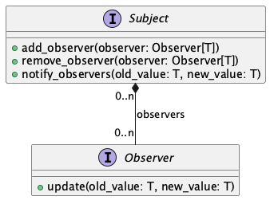

[English version below]

# TDLOG : deuxième séance

Ce fichier présente les exercices de la deuxième séance du module. L'objectif
est de produire un code de qualité (lisibilité, nommage, commentaires) et non
pas de couvrir le maximum d'exercices. Les exercices sont à faire en binôme, et
en anglais (noms des fonctions et variables, commentaires). Lors de cette
séance, on s'intéresse à l'application de deux _design patterns_ communs : le
_pattern_ "observer" et le pattern "proxy". Les règles du jeu sont rappelées
en annexe.

## Exercice : implémentation du _pattern_ "observer"

Le _pattern_ "observer" ([page Wikipedia](https://en.wikipedia.org/wiki/Observer_pattern))
est un _pattern_ qui permet de notifier une instance (appelée le plus souvent
"observateur") lorsqu'une autre instance (appelée le plus souvent "sujet" ou
"observable") est modifiée. Comme pour de nombreux _patterns_, il existe des
variantes. On a retenu ici une variante relativement simple.

Le diagramme de classes UML ci-dessous résume le _pattern_, qui contient deux
protocoles, le sujet et l'observateur. Le sujet est une instance qui contient
une donnée et une collection d'observateurs. Un observateur est une instance
qui souhaite être notifiée en cas de modification du sujet qu'elle observe.



La méthode `add_observer` (respectivement `remove_observer`) permet à un
observateur de s'enregistrer (respectivement "désenregistrer") pour indiquer
qu'il est (respectivement n'est plus) intéressé par les modifications d'un
sujet.

Lorsque la donnée du sujet est modifiée, il appelle `notify_observers` qui en
conséquence appelle `update` sur chacun des observateurs enregistrés.
L'intérêt du *pattern* est la centralisation du code de mise à jour :
lorsque l'on travaille sur le sujet, on n'a pas à ce souvenir des conséquences
d'un changement, seulement à le signaler. Une limite du *pattern* est que
certains scénarios sont mal supportés : par exemple s'il y a des modifications
de manière répétée et qu'on ne souhaite propager que la valeur finale.

Les protocoles sont fournis dans le fichier [observer.py](./observer.py). La
première étape consiste à ajouter au fichier des classes implémentant ces
protocoles.

La seconde étape consiste à montrer au travers d'un court code comment ces
classes peuvent être utilisées et qu'elles se comportent comme attendu. Par
exemple, on peut définir un sujet qui stocke un simple entier et des
observateurs qui affichent des messages à l'écran lorsque l'entier est modifié.
Soit un code semblable à :

```python
my_subject = SubjectClass(0)
my_first_observer = FrenchObserverClass(...)
my_second_observer = EnglishObserverClass(...)
my_subject.change_value(123)
my_subject.add_observer(my_first_observer)
my_subject.add_observer(my_second_observer)
my_subject.change_value(456)
my_subject.remove_observer(my_first_observer)
my_subject.change_value(789)
```

et dont l'exécution produirait un affichage semblable à :

```
valeur observée changée de 123 à 456
observed value changed from 123 to 456
observed value changed from 456 to 789
```

## Exercice optionnel : utilisation du _pattern_ "observer"

Le notebook [ScotlandYard.ipynb](./ScotlandYard.ipynb) utilise les librairies
`ipywidgets` et `PIL` pour proposer une interface du jeu avec les positions des
joueurs, les tickets dont ils disposent, etc. Lorsque vous exécutez le notebook
pour la première fois, sélectionnez l'environement Python
`/usr/local/python/current/bin/python`.

La variable `held_tickets_widgets` du notebook est un dictionnaire des couleurs
des détectives et vers les _widgets_ affichant sur la partie droite de l'interface
graphique les nombres de tickets. La valeur affichée par un tel _widget_ `w`
peut être modifiée en assignant à `w.value` une chaîne de caractères.

La troisième étape consiste à utiliser le _pattern_ "observer" de telle sorte
que les valeurs affichées par ces _widgets_ soient automatiquement mise à jour
lorsque l'instance correspondante de `player.Tickets` est modifiée.

(Note : nous verrons une autre manière d'organiser le code des interfaces
graphiques dans la séance sur l'architecture.)

## Annexe : règles du jeu

Le jeu [Scotland Yard / Mister X](<https://fr.wikipedia.org/wiki/Scotland_Yard_(jeu)>)
est publié sous quelques variantes par Ravensburger. Il s'agit d'un jeu de
plateau dans lequel plusieurs détectives de Scotland Yard cherchent à attraper
un fugitif, Mister X. Une version des règles est disponible à l'adresse suivante :
https://www.ravensburger.co.uk/gameinstructions/ecm/Spielanleitungen/26646%20anl%202050897_2.pdf

On propose ci-dessous une version légèrement simplifiée du jeu.

Le [plateau](./board.png) représente le centre de Londres et son réseau de
transport, avec des stations numérotées de 1 à 199. Les connexions entre les
stations sont de quatre types : bus (turquoise), taxi (jaune), métro (rouge) et
ferry (noir). Les trois premiers types sont utilisables par les détectives et
Mister X, mais le quatrième n'est utilisable que par Mister X. Sur le plateau,
la représentation peut prendre trois formes différentes selon que la station :

- n'est accessible qu'en taxi - elle est dans ce cas uniformément jaune ;
- est accessible en taxi et bus - elle est dans ce cas jaune et turquoise ;
- est accessible en taxi, bus et métro - elle est dans ce cas jaune, turquoise
  et rouge;
- (l'accès en ferry n'est pas représenté graphiquement sur la station).

Le jeu oppose Mister X, qui utilise un pion de couleur noire, à un à cinq
détectives dont les couleurs possibles sont : orange, bleu, vert, rouge, et
violet.

Les positions initiales des détectives et de Mister X sont déterminées
aléatoirement. Les détectives placent leurs pions sur leurs positions initiales,
mais la position initiale de Mister X n'est pas révélée. Chaque détective
reçoit : 4 tickets de métro, 8 tickets de bus et 11 tickets de taxi. Les autres
tickets (23 tickets de métro, 45 tickets de bus et 57 tickets de taxi avant
distribution) sont placés dans la pioche. Mister X reçoit 3 tickets doubles et
5 tickets noirs.

À chaque tour :

- Mister X se déplace :
  - soit en utilisant un ticket de la pioche correspondant au mode de transport
    pour suivre un lien reliant deux stations ;
  - soit en consommant un ticket noir, qui lui permet de suivre n'importe quel
    lien de transport (y compris en ferry) ;
  - soit en consommant un ticket double, qui lui permet de faire deux
    déplacements successifs, suivant les possibilités des deux items précédents ;
- chaque détective, successivement, se déplace :
  - en consommant l'un des tickets qu'il détient correspondant au mode de transport
    pour suivre un lien reliant deux stations ;
  - en plaçant le ticket consommé dans la pioche.

Mister X, comme chaque détective, est tenu de se déplacer à chaque tour. La
seule exception concerne les détectives dont la situation (station et tickets
disponibles) rend tout déplacement impossible. Deux détectives ne peuvent se
trouver à la même station en même temps.

La partie prend fin lorsque :

- le 23 ème tour a été atteint ou plus aucun détective ne peut se déplacer,
  dans ce cas Mister X gagne ;
- un détective se trouve à la même station que Mister X, dans ce cas les
  détectives gagnent collectivement.

# TDLOG: second session

This file contains the exercises for the second session of the course. The
objective is to produce a code of quality (readability, naming, comments) rather
than to cover as many exercises as possible. The exercises must be done in teams
of two, and in English (function and variable names, comments). During this
session, we are interested in the application of two common design patterns: the
observable pattern and the proxy pattern. The rules of the game are below,
in the appendix.

## Exercise: implementation of the "observer" pattern

The "observer" pattern ([Wikipedia
page](https://en.wikipedia.org/wiki/Observer_pattern)) is a pattern supporting
the notification of an instance (commonly referred to as "observer") when
another instance (commonly referred to as "subject" or "observable") is
modified. As for numerous other patterns, many variants exist. We have chosen a
relatively simple one for the exercises below.

The UML class diagram below summarizes the pattern, which defines two protocols,
namely the subject and the observer. A subject is an instance that stores a
piece of data and a collection of observers. An observer is an instance that
wishes to be notified when the subject it observes is modified.


The `add_observer` (respectively `remove_observer`) method can be used by an
observer to register (respectively unregister) its interest (respectively lack of
interest) in the modifications of a subject.

When the subject is modified, it calls `notify_observers`, which in turns calls
`update` on each of the registered observers. The pattern is interesting because
the logic behind updates is put in a central place: when working on the subject,
it is not necessary to remember the consequences of a change, only to signal it.
A limit of the pattern is that some scenarios are not supported: for instance,
if there are many changes and we want to propagate only the final value.

The protocols are defined in the [observer.py](./observer.py) file. The first
step is to add to the file classes implementing these protocols.

The second step is to show through a short code of how these classes can be
used, and that they behave as expected. For instance, we can define a subject
that stores a mere integer and observers that print messages when the integer is
modified. Thus a code similar to:

```python
my_subject = SubjectClass(0)
my_first_observer = FrenchObserverClass(...)
my_second_observer = EnglishObserverClass(...)
my_subject.change_value(123)
my_subject.add_observer(my_first_observer)
my_subject.add_observer(my_second_observer)
my_subject.change_value(456)
my_subject.remove_observer(my_first_observer)
my_subject.change_value(789)
```

and whose execution would produce an output similar to :

```
valeur observée changée de 123 à 456
observed value changed from 123 to 456
observed value changed from 456 to 789
```

## Optional exercise: use of the "observer" pattern

The [ScotlandYard.ipynb](./ScotlandYard.ipynb) notebook uses the `ipywidgets`
and `PIL` libraries to implement a graphical user interface (GUI) for the game, with
the positions of the players, the tickets they hold, etc. When you run the notebook
for the first time, select the `/usr/local/python/current/bin/python` Python
environment.

The `held_tickets_widgets` variable of the notebook is a dictionary from the
detective colors to the widgets displaying on the right-hand side of the graphical
interface the numbers of tickets. The value displayed by a `w` widget can be
modified by assigning a string to  `w.value`.

The third step is to use the "observer" pattern in such a way that the values
displayed by the widgets are automatically updated when the related instance of
`player.Tickets` is modified.

(Note: we will see another way to organize the code of graphical user interfaces
during the session about architecture.)

## Appendix: rules

The [Scotland Yard / Mister X](<https://en.wikipedia.org/wiki/Scotland_Yard_(board_game)>)
game has been published by Ravensburger under several variants. It is a board
game during which a handful of detectives try to catch a fugitive, Mister X. A
version of the rules is available at the following address:
https://www.ravensburger.co.uk/gameinstructions/ecm/Spielanleitungen/26646%20anl%202050897_2.pdf

Below is a slightly simplified version of the game.

The [board](./board.png) represents the center of London and its transportation
network, with stations numbered from 1 to 199. The connections between the
stations are of four kinds : bus (turquoise), taxi (yellow), underground (red),
and ferry (black). The first three kinds can be used by the detectives and
Mister X, but the fourth kind can only be used by Mister X. On the board, the
representation can take one of three forms depending on whether the station:

- can be accessed only by taxi - it is in this case yellow;
- can be accessed by taxi and bus - it is in this case yellow and turquoise;
- can be accessed by taxi, bus, or underground - it is in this case yellow,
  turquoise, and red;
- (ferry access is not represented graphically).

The game pits Mister X, represented by a black pawn, against one to five
detectives whose possible pawn colors are: orange, blue, green, red, and purple.

The initial positions of the detectives and of Mister X are determined randomly.
The detectives place their pawns on the board, but the initial position of
Mister X is not revealed. Each detective gets: 4 underground tickets, 8 bus
tickets, and 11 taxi tickets. The other tickets (23 underground tickets, 45 bus
tickets, and 57 taxi tickets, before the detective take theirs) are placed into
the supply pile. Mister X gets three 3 double tickets and 5 black tickets.

During each turn:

- Mister X moves:
  - either by using a ticket from the supply pile corresponding to the mode of
    transportation to follow a connection between two stations;
  - or by consuming a black ticket, to follow any connection (including a ferry one);
  - or by consuming a double ticket, allowing them to move twice in a row, according
    to the possibilities of one of the previous two items;
- each detective, one after the other, moves:
  - by consuming a ticket they hold corresponding to the mode of transportation to
    follow a connection between two stations;
  - by placing the consumed ticket into the supply pile.

Mister X, as well as each detective, has to move at each turn. The only
exception is for detectives in such circumstances (station and available
tickets) that no move is possible. Two detectives cannot be at the same station
at the same time.

The game ends when:

- the 23rd turn has been reached or no detectives can move, in which case Mister X
  wins;
- a detective is at the same station as Mister X, in which case the detectives
  collectively win.
# TDLOG
